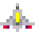

# Alien Invaders 
   

A classic arcade-style space shooter game built with Python and Kivy. Defend Earth from waves of alien invaders in this retro-inspired game featuring smooth animations, sound effects, and progressive difficulty.


## Table of Contents

- [Features](#features)
- [Screenshots](#screenshots)
- [Requirements](#requirements)
- [Installation](#installation)
- [How to Run](#how-to-run)
- [Game Controls](#game-controls)
- [Gameplay](#gameplay)
- [Customization](#customization)
- [Project Structure](#project-structure)
- [Credits](#credits)

## Features

### Core Gameplay
- **Classic Space Invaders Mechanics**: Navigate your ship and shoot down waves of aliens
- **Multiple Alien Types**: Three different alien variants with unique sprites
- **Progressive Difficulty**: Game speed increases as you eliminate aliens
- **Lives System**: Start with 3 lives, track your progress with heart icons
- **Scoring System**: Earn 10 points per alien destroyed
- **Defense Line**: Protect the defense line - game ends if aliens cross it

### User Interface
- **Title Screen**: Retro-style arcade interface
- **Live Score Display**: Real-time score tracking at the top of the screen
- **Lives Indicator**: Visual hearts display with color coding:
  - Green: 3 lives
  - Yellow: 2 lives
  - Red: 1 life
- **On-Screen Instructions**: Quick reference for controls
- **Game Over/Complete Screens**: Clear end-game states with replay options

### Game Features
- **Pause Function**: Press 'P' to pause during gameplay
- **Restart Function**: Replay after game completion
- **Exit Function**: Clean exit from game over screen
- **Sound Effects**: Immersive audio including:
  - Startup music
  - In-game background music
  - Alien destroyed sounds
  - Ship destroyed sounds
  - Bolt firing sounds (player and alien)

### Technical Features
- **Smooth Animations**: Sprite-based animations for ships and aliens
- **Collision Detection**: Precise hit detection for bolts and ships
- **State Management**: Clean game state transitions
- **Customizable Difficulty**: Command-line arguments for custom game settings

## Screenshots

### Title Screen

*Press 'S' to start your mission*

### Active Gameplay

*Battle waves of alien invaders while protecting the defense line*

### Game Over

*Challenge yourself to beat your high score*

## Requirements

- Python 3.7 or higher
- pip (Python package installer)

### Python Dependencies
- `kivy` - Cross-platform framework for game development
- `introcs` - Cornell CS1110 course library for graphics
- `numpy` - Numerical computing library
- `pillow` - Python Imaging Library

## Installation

1. Clone or download this repository:
```bash
git clone <repository-url>
cd alien-invaders
```

2. Install required dependencies:
```bash
pip3 install kivy introcs
```

The installation will also automatically install `numpy` and `pillow` as they are dependencies of the required packages.

## How to Run

### Basic Usage

Run the game with default settings:
```bash
python3 __main__.py
```

### Custom Game Settings

You can customize the game difficulty using command-line arguments:
```bash
python3 __main__.py [rows] [aliens_per_row] [speed]
```

**Parameters:**
- `rows`: Number of alien rows (1-10, default: 5)
- `aliens_per_row`: Number of aliens per row (1-15, default: 12)
- `speed`: Alien movement speed in seconds (0-3, default: 1)

**Examples:**
```bash
# Easy mode: 3 rows, 8 aliens per row, slower speed
python3 __main__.py 3 8 1.5

# Hard mode: 8 rows, 12 aliens per row, faster speed
python3 __main__.py 8 12 0.5

# Insane mode: Maximum aliens, fastest speed
python3 __main__.py 10 15 0.3
```

## Game Controls

| Key | Action |
|-----|--------|
| **S** | Start game from title screen |
| **←** | Move ship left |
| **→** | Move ship right |
| **SPACEBAR** | Fire bolt |
| **P** | Pause/Unpause game |
| **Y** | Restart game (from game over screen) |
| **N** | Exit game (from game over screen) |

## Gameplay

### Objective
Destroy all alien invaders before they reach the defense line at the bottom of the screen.

### Rules
1. **Movement**: Aliens move in formation, shifting horizontally and descending when reaching screen edges
2. **Shooting**: Both you and the aliens can fire bolts
3. **Lives**: You start with 3 lives. Lose a life when hit by an alien bolt
4. **Defense Line**: If any alien crosses the red defense line, the game ends immediately
5. **Scoring**: Each alien destroyed awards 10 points
6. **Speed**: Game speed increases by 3% with each alien destroyed

### Win Conditions
- **Victory**: Destroy all aliens before they reach the defense line
- **Defeat**: Lose all 3 lives OR aliens cross the defense line

### Tips
- Keep moving to avoid alien fire
- Aim carefully - you can only have one bolt on screen at a time
- Focus on the bottom rows of aliens first to prevent them from crossing the defense line
- Use the pause feature (P) to take a break without penalty

## Customization

### Modifying Constants

Edit `consts.py` to customize various game parameters:

```python
# Window size
GAME_WIDTH = 800
GAME_HEIGHT = 700

# Ship settings
SHIP_LIVES = 3
SHIP_MOVEMENT = 5

# Alien settings
ALIEN_ROWS = 5
ALIENS_IN_ROW = 12
ALIEN_SPEED = 1

# Scoring
ALIEN_POINTS = 10
SPEED_FACTOR = 1.03

# Colors
BLACK_COLOR = introcs.RGB(0, 0, 0)
LIME = introcs.RGB(50, 205, 50)
RED_COLOR = introcs.RGB(255, 0, 0)
```

### Adding Custom Assets

Replace files in the respective folders:
- **Fonts/**: Custom fonts (.ttf files)
- **Images/**: Sprites and images (.png files)
- **Sounds/**: Audio files for game sounds

## Project Structure

```
alien-invaders/
├── __main__.py          # Entry point for the application
├── app.py               # Main application controller
├── wave.py              # Game level/wave controller
├── models.py            # Game object models (Ship, Alien, Bolt)
├── consts.py            # Game constants and configuration
├── features.txt         # Feature documentation
├── game2d/              # Game engine framework
│   ├── __init__.py
│   ├── app.py           # Base application class
│   ├── gobject.py       # Base game object classes
│   ├── gpath.py         # Path drawing utilities
│   ├── grectangle.py    # Rectangle game objects
│   ├── gsprite.py       # Sprite animation support
│   ├── gview.py         # View management
│   └── sound.py         # Sound management
├── Fonts/               # Font resources
├── Images/              # Game sprites and images
├── Sounds/              # Sound effects and music
└── screenshots/         # Game screenshots
```

### Key Files

- **__main__.py**: Initializes and runs the game
- **app.py**: Manages game states (inactive, active, paused, complete)
- **wave.py**: Handles game logic, collision detection, and wave management
- **models.py**: Defines Ship, Alien, and Bolt classes
- **consts.py**: Centralizes all game constants for easy customization

## Credits

**Authors**: Aryaman Thareja (aat53) | Michael Glenn (mdg258)
**Date**: December 9, 2021
**Original Framework**: Walker M. White (wmw2)
**Course**: Cornell CS1110

### Assets
- Sound effects: Free license sounds from Mixit
- Arcade font: Retro gaming font
- Sprites: Custom pixel art designs

### Technologies
- **Python**: Core programming language
- **Kivy**: Cross-platform game framework
- **introcs**: Cornell CS graphics library
- **NumPy**: Numerical operations
- **Pillow**: Image processing

## License

This project was created as part of Cornell University's CS1110 course. Please refer to the course policies regarding code usage and distribution.

---

**Enjoy defending Earth from the alien invasion!**

For issues or questions, please open an issue in the repository.
